# Disk Reliability Lab - Architecture Documentation

## System Architecture Overview

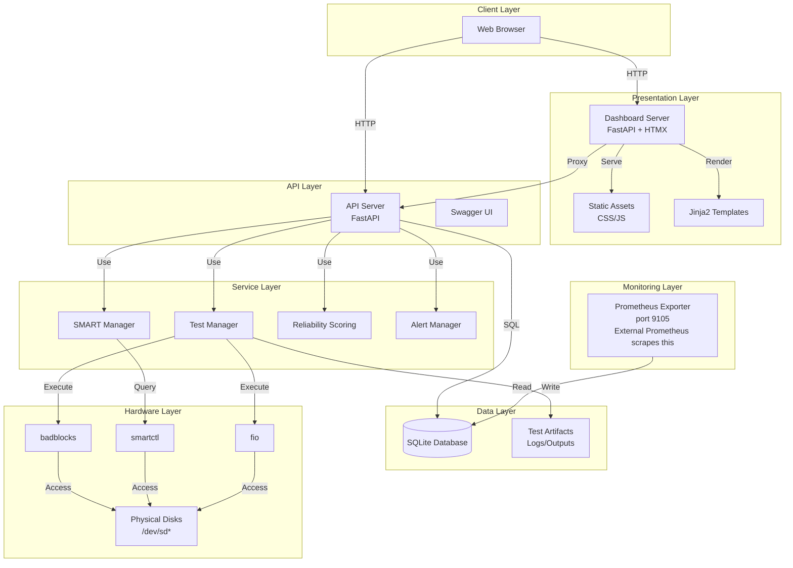

## Component Details

### Dashboard Server (`web_dashboard.py`)

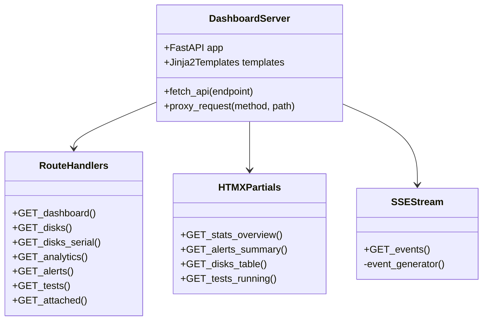

**Responsibilities:**
- Serve HTML templates with Jinja2
- Proxy API requests to backend
- Handle HTMX partial updates
- Provide SSE for real-time updates
- Serve static assets

### API Server (`api_server.py`)

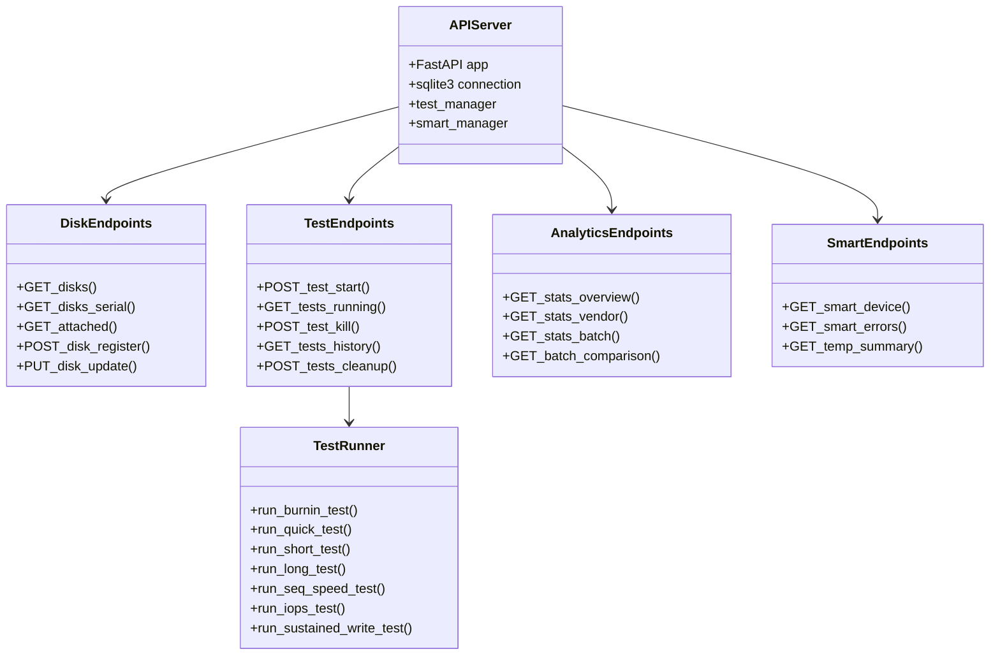

## Test Execution Flow

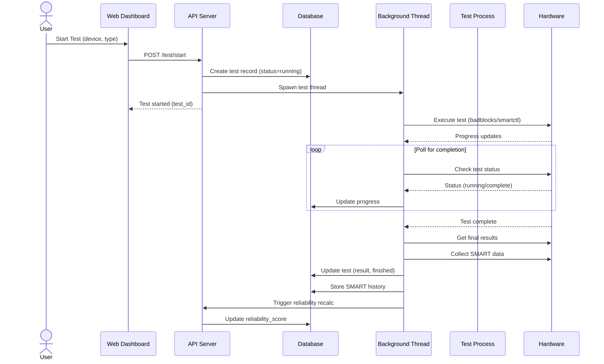

## Reliability Scoring Algorithm

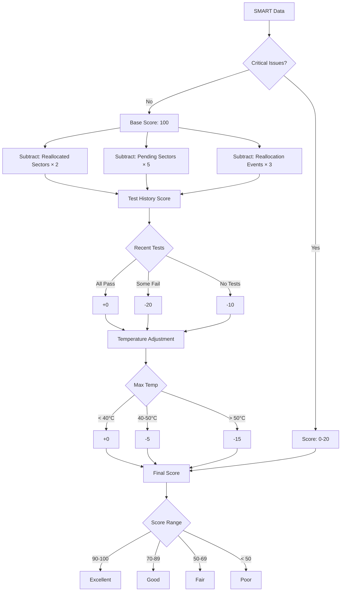

### Score Formula

```
Base Score = 100

SMART Penalties:
- Reallocated Sector Count: -2 per sector
- Pending Sector Count: -5 per sector
- Reallocation Events: -3 per event
- Critical Warnings: -80

Test History:
- All tests passed: +0
- Any test failed: -20
- No tests recorded: -10

Temperature:
- Max temp < 40°C: +0
- Max temp 40-50°C: -5
- Max temp > 50°C: -15

Latency Anomalies:
- 0-2 anomalies: +0
- 3-5 anomalies: -5
- 6+ anomalies: -10

Final Score = max(0, min(100, Base + Adjustments))
```

## Database Schema Relationships

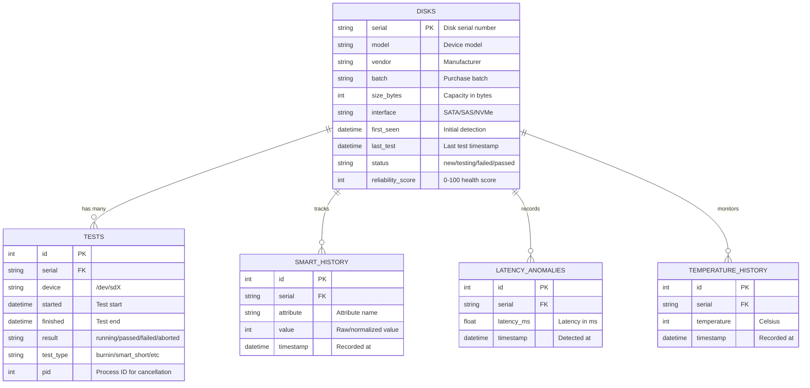

## Deployment Architecture

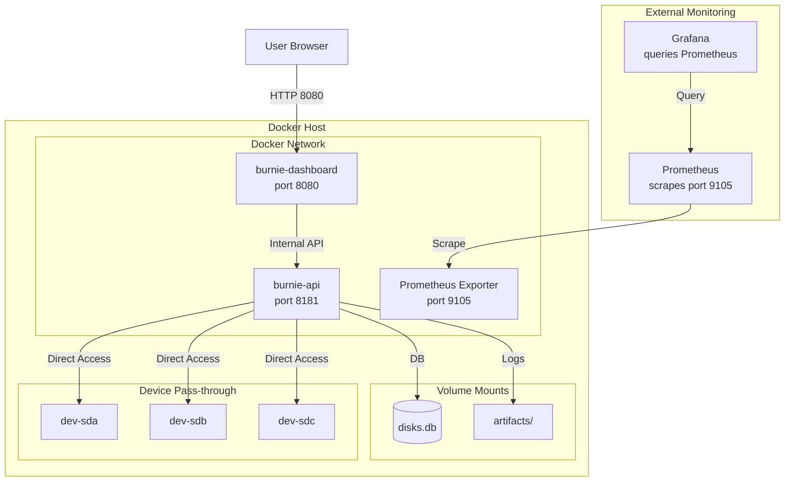

## Security Considerations

**Current State:** No authentication or authorization. The API and dashboard are open to anyone who can reach them.

**Privilege Requirements:**

| Operation | Privilege | Reason |
|-----------|-----------|--------|
| badblocks (destructive) | root / SYS_RAWIO | Direct disk access |
| smartctl | root / SYS_RAWIO | SMART data access |
| fio | root / SYS_RAWIO | Direct disk I/O |
| hdparm (secure erase) | root / SYS_ADMIN | ATA commands |
| Database read/write | user level | SQLite file access |

**Deployment Recommendations:**

- Run behind a reverse proxy (nginx, traefik) with authentication
- Use network policies / firewall rules to restrict access
- Consider adding API key authentication for remote access
- Docker privileged mode is required for disk access - isolate appropriately

## Error Handling Strategy

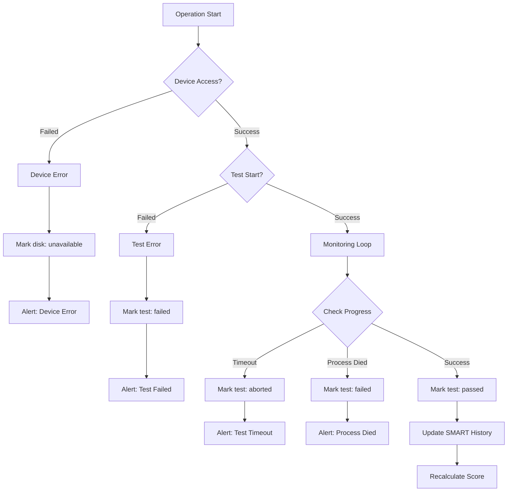

## Performance Considerations

### Concurrency Model

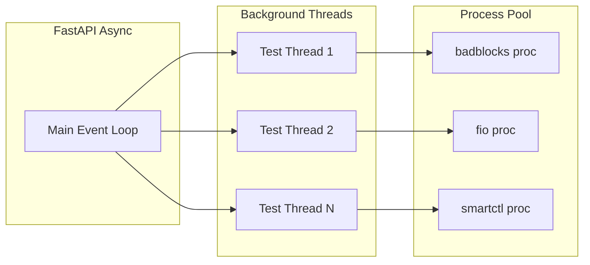

### Database Connection Management

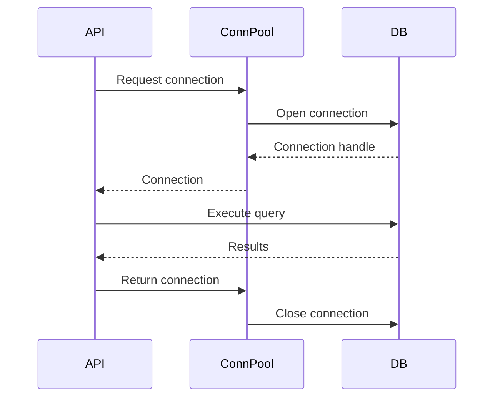

## Monitoring and Observability

### Metrics Collected

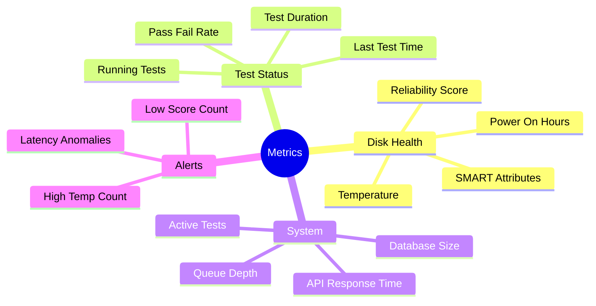

### Prometheus Metrics Exported

The `prometheus_exporter.py` exposes metrics on port 9105:

```prometheus
# Disk reliability score
disk_reliability_score{serial="XXXX"}
```

External Prometheus server scrapes this endpoint. Grafana dashboards can then query Prometheus to visualize the data.

## Extension Points

### Adding New Test Types

1. Implement test function in `api_server.py`
2. Add to `TestRequest.test_type` enum
3. Register in test router
4. Add UI option in `templates/tests.html`

### Adding New Analytics

1. Create query in `api_server.py`
2. Add endpoint `/stats/my_analytics`
3. Create chart in `templates/analytics.html`
4. Add to navigation

### Adding New Alerts

1. Define alert condition in `alert_manager.py`
2. Add to `/alerts` endpoint response
3. Create UI display in `templates/alerts.html`
4. Add notification handler
