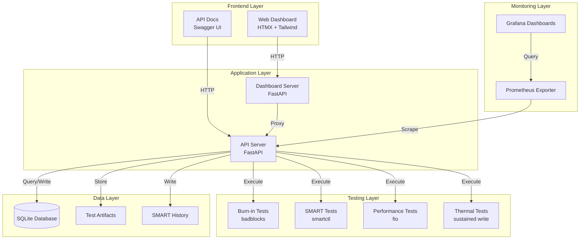
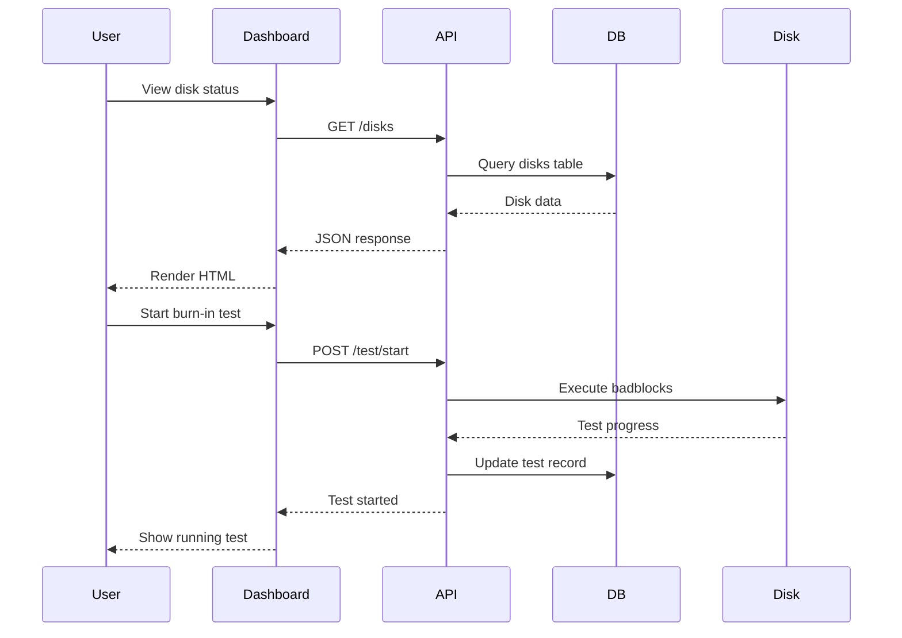
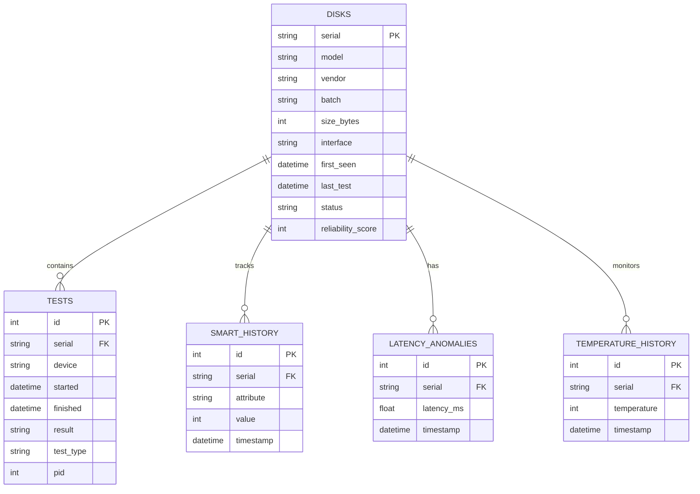
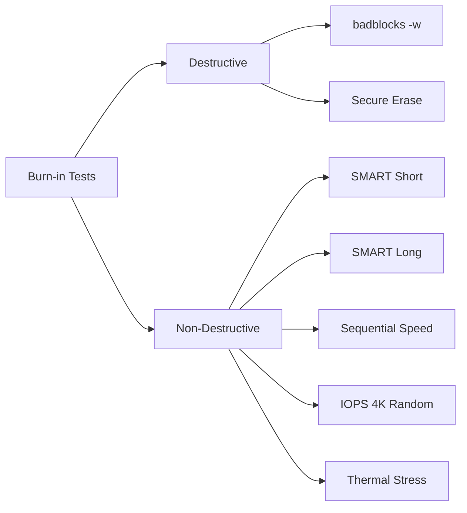
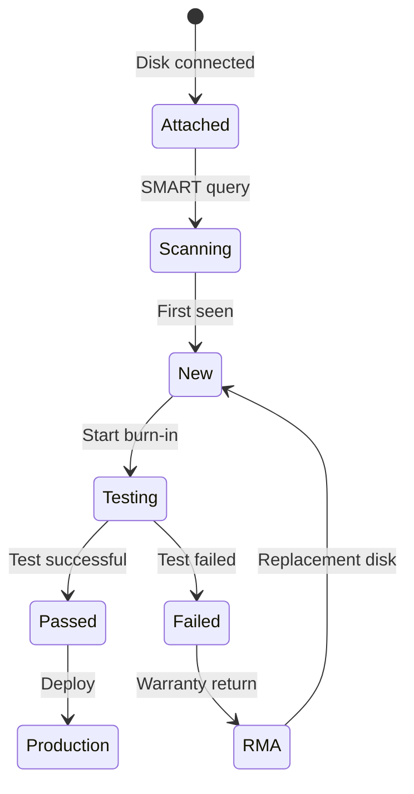

# Disk Reliability Lab

A full-featured disk validation and reliability analytics platform inspired by large-scale storage operators like Backblaze, Google, and Facebook.

## Table of Contents

- [Overview](#overview)
- [Architecture](#architecture)
- [Quick Start](#quick-start)
- [Features](#features)
- [Testing Guide](#testing-guide)
- [API Documentation](#api-documentation)
- [Configuration](#configuration)
- [Development](#development)

## Overview

**Why Burn-in Disks?**

Enterprise storage operators know that new disks are the most unreliable component in any storage system. Factory defects show up early (infant mortality), and deploying untested disks is a recipe for data loss and expensive RAID rebuilds.

**The Testing Philosophy:**

> "A disk that survives 24 hours of burn-in testing is exponentially more likely to survive its warranty period than one that hasn't been tested."

This tool implements that philosophy at scale, tracking hundreds of disks through their testing lifecycle with comprehensive analytics.

## Architecture



### Data Flow



### Database Schema



### Test Types



## Quick Start

### Prerequisites

- Linux host with disk access (sudo privileges)
- Docker and Docker Compose (recommended)
- Python 3.11+ (for manual setup)

### Option A: Docker Compose (Recommended)

```bash
# Clone repository
git clone https://github.com/jwcrowley/burnie.git
cd burnie

# Initialize database
docker compose run --rm api python3 -c "import sqlite3; conn = sqlite3.connect('disks.db'); conn.executescript(open('schema.sql').read()); conn.commit()"

# Start all services
docker compose up -d

# View logs
docker compose logs -f

# Access dashboard
open http://localhost:8080
```

**Services exposed:**
- Dashboard: http://localhost:8080
- API: http://localhost:8181
- API Docs: http://localhost:8181/docs

### Option B: Manual Setup

```bash
# Install system dependencies
sudo apt-get update
sudo apt-get install -y smartmontools e2fsprogs fio hdparm

# Install Python dependencies
pip3 install -r requirements.txt

# Initialize database
python3 -c "import sqlite3; conn = sqlite3.connect('disks.db'); conn.executescript(open('schema.sql').read()); conn.commit()"

# Start API server
python3 api_server.py &

# Start dashboard
python3 web_dashboard.py
```

## Features

### Test Types

| Test Type | Description | Duration | Destructive |
|-----------|-------------|----------|-------------|
| **Burn-in Test** | Full surface scan with badblocks | ~24h | ✅ Yes |
| **SMART Short** | Quick SMART self-test | ~2min | ❌ No |
| **SMART Long** | Comprehensive SMART test | ~4h | ❌ No |
| **Sequential Speed** | Read/write throughput test | ~5min | ❌ No |
| **IOPS 4K Random** | Random 4K I/O performance | ~5min | ❌ No |
| **Thermal Stress** | Sustained write for thermal testing | ~30min | ❌ No |
| **Secure Erase** | ATA secure erase (wipes data) | ~2h | ✅ Yes |

### Dashboard Features

- **Main Dashboard**: Overview with stats cards, charts, and recent activity
- **Disks View**: Searchable/filterable list of all disks
- **Disk Detail**: Individual disk views with SMART data, temperature history, test results
- **Analytics**: Charts for reliability trends, vendor/model comparisons, batch performance
- **Alerts**: Centralized alert management for low scores, high temperatures, latency issues
- **Test Queue**: Test queue management and history tracking
- **Attached Disks**: Physical disk management with blink feature for identification

## Testing Guide

### New Disk Workflow



### Running Tests

#### Individual Test via Web UI

1. Navigate to **Tests** page
2. Select device from dropdown
3. Choose test type
4. Click **Start Test**

#### Batch Burn-in (CLI)

```bash
# Interactive mode - select disks individually
sudo ./batch_burnin.sh

# List all available disks
sudo ./batch_burnin.sh --list

# Test specific devices
sudo ./batch_burnin.sh --devices /dev/sdb,/dev/sdc
```

#### Via API

```bash
# Start burn-in test
curl -X POST http://localhost:8181/test/start \
  -H "Content-Type: application/json" \
  -d '{"device": "/dev/sdb", "test_type": "burnin"}'

# Start SMART test
curl -X POST http://localhost:8181/test/start \
  -H "Content-Type: application/json" \
  -d '{"device": "/dev/sdb", "test_type": "smart_short"}'
```

### Interpreting Results

**Reliability Score Components:**

- **SMART Attributes** (40%): Reallocated sectors, pending sectors, errors
- **Test Results** (30%): Recent test pass/fail rate
- **Age/Usage** (15%): Power-on hours, cycle count
- **Temperature** (10%): Operating temperature history
- **Latency** (5%): Anomalous latency events

**Score Interpretation:**
- 90-100: Excellent - Ready for production
- 70-89: Good - Monitor closely
- 50-69: Fair - Investigate issues
- Below 50: Poor - Do not deploy

## API Documentation

### Core Endpoints

#### Disks

```
GET  /disks                    - List all disks
GET  /disks/{serial}           - Get disk details
GET  /attached                 - List attached physical disks
POST /disk/register            - Register new disk
PUT  /disk/update/{serial}     - Update disk info
```

#### Tests

```
POST /test/start               - Start a test
GET  /tests/running            - List running tests
POST /test/kill/{id}           - Kill a running test
GET  /tests/history            - Test history
GET  /tests/cleanup            - Cleanup stale tests
```

#### Analytics

```
GET  /stats/overview           - Dashboard overview
GET  /stats/vendor             - Reliability by vendor
GET  /stats/batch              - Reliability by batch
GET  /stats/batch-comparison   - Compare disk batches
```

#### SMART & Health

```
GET  /smart/{device}           - Get SMART data
GET  /smart-errors/{device}    - SMART error log
GET  /temperature/summary      - Temperature summary
GET  /alerts                   - Active alerts
```

### Interactive API Docs

Once running, visit:
- **Swagger UI**: http://localhost:8181/docs
- **ReDoc**: http://localhost:8181/redoc

## Configuration

### Environment Variables

Edit `config.env`:

```bash
# Database
DB=./disks.db

# API Server
API_PORT=8000
API_HOST=0.0.0.0

# Dashboard
DASHBOARD_PORT=8080
DASHBOARD_REFRESH_INTERVAL=30

# Alerts
ALERT_RELIABILITY_THRESHOLD=70
ALERT_TEMPERATURE_THRESHOLD=45

# Testing
BURNIN_TIMEOUT=86400
SMART_TIMEOUT=14400
```

### Docker Compose

Edit `docker-compose.yml` to:
- Add device mappings for your disks
- Adjust port mappings
- Configure volume mounts
- Set resource limits

### Disk Device Mapping

Add your hotswap bays to `docker-compose.yml`:

```yaml
devices:
  - /dev/sda:/dev/sda
  - /dev/sdb:/dev/sdb
  - /dev/sdc:/dev/sdc
  # Add more as needed...
```

## Development

### Project Structure

```
burnie/
├── api_server.py           # Main FastAPI application
├── web_dashboard.py        # Dashboard server
├── schema.sql              # Database schema
├── requirements.txt        # Python dependencies
├── Dockerfile             # Container build
├── docker-compose.yml     # Service orchestration
├── batch_burnin.sh        # CLI batch testing
├── templates/             # HTML templates
│   ├── base.html
│   ├── dashboard.html
│   ├── disks.html
│   ├── disk_detail.html
│   ├── analytics.html
│   ├── alerts.html
│   ├── tests.html
│   └── attached.html
├── static/                # Static assets
│   ├── css/
│   └── js/
├── grafana/              # Grafana dashboard configs
└── archive/              # Deprecated scripts
```

### Adding New Tests

1. Add test function to `api_server.py`
2. Add to test type dropdown in `templates/tests.html`
3. Document in README

Example:

```python
@app.post("/test/start")
async def start_test(request: TestRequest):
    if request.test_type == "my_new_test":
        return await run_my_new_test(request.device)
```

### Technology Stack

- **Backend**: FastAPI (async Python web framework)
- **Frontend**: HTMX (dynamic UI without complex JavaScript)
- **Styling**: Tailwind CSS (responsive, modern UI)
- **Charts**: Chart.js (interactive visualizations)
- **Database**: SQLite (with PostgreSQL support planned)
- **Monitoring**: Prometheus + Grafana
- **Deployment**: Docker/Docker Compose

## License

## License

This program is free software: you can redistribute it and/or modify it under the terms of the GNU General Public License as published by the Free Software Foundation, either version 3 of the License, or (at your option) any later version.

This program is distributed in the hope that it will be useful, but WITHOUT ANY WARRANTY; without even the implied warranty of MERCHANTABILITY or FITNESS FOR A PARTICULAR PURPOSE. See the [GNU General Public License](LICENSE) for more details.
